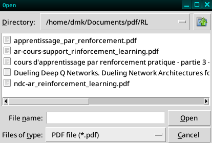

# imgext
Image extraction from document.

## Installation

```sh
pip install https://github.com/CodiTheck/imgext/archive/refs/heads/master.zip
```

## Usage
To use this program, execute the following command by passing it the path to
the document file containing the images to extract.

```sh
imgext [path/to/my_file.ext]
```

Or simply run the `imgext` command, which will open a file selection window
allowing you to select your file.

```sh
imgext
```
<div align="center">



</div>
